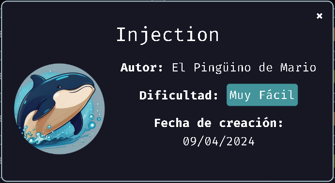
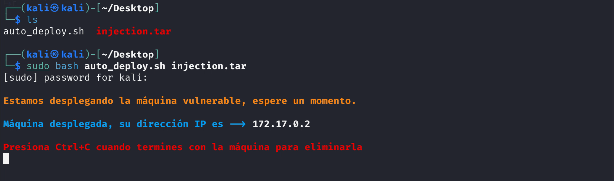
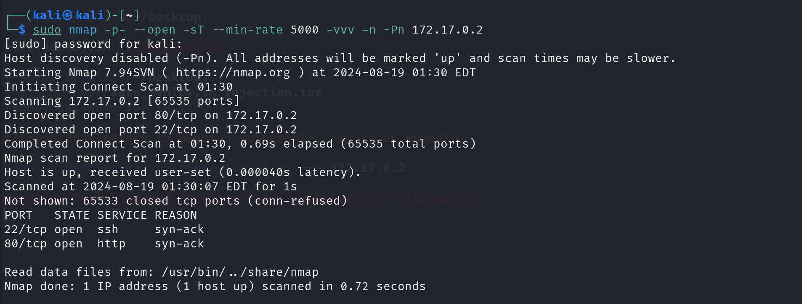

## MÁQUINA INJECTION



### Introducción

Este repositorio contiene una guía práctica para explotar la máquina "Injection", enfocada en técnicas de inyección SQL (SQLi) y escalada de privilegios. A través de comandos detallados y ejemplos visuales, aprenderás a desplegar la máquina, identificar vulnerabilidades y obtener control del sistema.

#### ¿Qué encontrarás aquí?

Despliegue y configuración de la máquina "Injection" con Docker.
Reconocimiento de puertos y servicios usando Nmap.

Explotación de SQLi para acceder a la base de datos.

Escalada de privilegios mediante la identificación de permisos SUID.

Este proyecto es ideal para quienes desean fortalecer sus habilidades en hacking ético y ciberseguridad en un entorno controlado.

### Despliegue de la maquina

#### ¡VAMOS A EMPEZAR!

Primero, vamos a ir a Dockerlabs y descargaremos el .ZIP de la máquina Injection.

Después de arrastrar los archivos a una carpeta, nos iremos a la terminal y nos dirigiremos hacia la carpeta con esos archivos.

Cuando estemos en la carpeta, desplegaremos la máquina mediante:

```
sudo bash auto_deploy.sh injection.tar
```



Ya teniendo la IP de la máquina, haremos ping para verificar si hay comunicación y comprobar la conexión:

```
ping <IP máquina>
```

### Escaneo de puertos 

Ahora deberíamos ver qué puertos están abiertos para saber cómo acceder a la máquina. Haremos un escaneo con NMAP utilizando las siguientes opciones:

```
nmap -p- --open -sT --min-rate 5000 -vvv -n -Pn <IP máquina>
```



Antes de analizar los resultados, vamos a explicar qué hemos hecho en este comando y por qué no hemos utilizado otras opciones:

Nmap: La herramienta para el escaneo de puertos.
-p-: Escanea todos los puertos.
--open: Muestra solo los puertos abiertos.
-sT: No requiere permisos root, funciona en cualquier entorno, establece una conexión más completa y, además, confirma que el puerto realmente está disponible para la comunicación.

¿Y por qué no -sS?
Es cierto que es más rápido, sigiloso, más eficiente, y es el preferido para las auditorías, pero requiere permisos root y no establece una conexión completa.

--min-rate 5000: Fuerza a Nmap a enviar una tasa mínima de paquetes.
-vvv: Proporciona información muy detallada sobre lo que hace Nmap y muestra los resultados durante el escaneo.
-n: No intenta resolver las direcciones IP a nombres de dominio.
-Pn: Asume que el host está en línea y no realiza ping.

(Opcional pero recomendable) 
-sV: Para ver la versión de los servicios en los puertos escaneados.

Ahora bien, en este punto observaremos que los puertos 22 y 80 están abiertos. En este caso, el puerto 22 no lo usaremos de momento, ya que tiene el protocolo SSH y no tenemos ni usuario ni contraseña.

### SQLi

Vamos a explorar el puerto con el protocolo HTTP. Con esto podemos probar si al poner la IP en el navegador podemos ver una página.

En este caso, estamos viendo una página de registro. Aquí podremos hacer dos cosas:

1. Probar todas las combinaciones comunes que suelen haber por defecto (root, admin, user, password, 123...).

2. Probar SQL Injection (SQLi). Antes de inyectar código SQL, quiero matizar que hay tres tipos de SQLi:

   1. In-Band.
   2. Out-of-Band.
   3. Blind.
   
Viendo que hay tres tipos, debemos saber cuál vamos a utilizar y el porqué. En nuestro caso, usaremos el primer tipo, In-Band, ya que es el más común y es el que nos sirve ahora para hacer este ejercicio de una manera más rápida. Aun así, recomiendo que exploren los otros dos tipos para ver qué función tienen.

Ahora bien, ¿cómo atacaremos esta página de registro? Muy fácil. Usaremos este payload:

```
' OR 1=1 --
```

Al igual que antes con NMAP, vamos a ver qué hace este payload:

': Esta comilla cierra la cadena de texto que debería contener un valor (en este caso, el usuario).
OR 1=1: Nos ayuda a que esta condición siempre sea verdadera. Al usar OR, se está diciendo "selecciona registros donde la condición original sea cierta o donde 1 sea igual a 1", lo que significa que siempre seleccionará registros.
--: Esto nos evita la molestia de pensar cuál es la contraseña, ya que el código siguiente a esto estará comentado.
(Información adicional)
-- o -- -: Ambos hacen la misma función.
': Antes de la comilla simple, puedes poner algo si te apetece.
¿Se pueden usar otros métodos? Sí, UNION, por ejemplo, pero eso lo probaremos en otras máquinas.

Vamos a verlo un poco mejor con este ejemplo:

El registro con código SQL:

```
SELECT * FROM users WHERE username = 'usuario' AND password = 'contraseña';
```
El registro con código SQL y con la inyección:

```
SELECT * FROM users WHERE username = '' OR 1=1 -- ' AND password = '';
```

Ahora, después de todo esto, ya podemos ver un mensaje que dice "¡Bienvenido, Dylan!" y con una cadena de números y letras que es la contraseña.

### Escalar privilegios

Ya sabiendo los puertos abiertos que hemos visto anteriormente y que ya conocemos el usuario y la contraseña, podemos probar suerte con el puerto 22, que tiene el servicio SSH. Vamos a escribir:

```
ssh dylan@<IP maquina>
```

Ahora, viendo que ya somos Dylan, vamos a intentar escalar privilegios. ¿Cómo lo hacemos? Primero, debemos revisar qué permisos de usuario tenemos; además, esto es una buena práctica para futuras máquinas.

```
sudo -l
```

Nos sale un mensaje indicando que el comando sudo no funciona.

¿Cómo podemos seguir? Podemos intentar buscar binarios con permisos especiales, como SUID o SGID.

En nuestro caso, vamos a buscar permisos SUID, ya que no hace falta buscar más. Aun así, dejaré el comando para buscar los permisos especiales SGID.

```
find / -perm -4000 2>/dev/null
```

Antes de explicar qué hace el comando, recomendaría explorar más opciones, ya que puedes filtrar por tipos de archivo, mostrar detalles sobre el archivo, etc.

¿Qué hace el comando?

find /: Inicia la búsqueda en el directorio raíz y recorre todo el sistema de archivos.
-perm -4000: Con esto, buscamos archivos que tengan permisos especiales llamados SUID. Este permiso hace que cuando alguien ejecuta el archivo, lo haga con los privilegios del dueño del archivo.
2>/dev/null: Envía todos los mensajes de error a un lugar donde no se ven, y así tenemos una salida de comando limpia.

La opción que busca también SGID:

```
find / -perm -4000 -a -perm -2000 2>/dev/null
```

Esto hace exactamente que, con el operador AND (-a), busque los archivos con permisos especiales SUID y SGID, utilizando el número 2000.

### Último paso

root
