## MÁQUINA OBSESSION

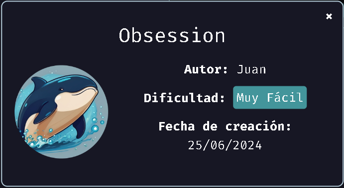

### Introducción

En esta guía, exploraremos la máquina "Obsession" paso a paso, desde el despliegue inicial hasta la identificación de vulnerabilidades que nos permitirán avanzar en la explotación. Este documento te guiará en técnicas de reconocimiento, explotación de servicios y escalada de privilegios.

#### ¿Qué encontrarás aquí?

1. Despliegue y configuración de la máquina "Obsession".
2. Escaneo de puertos y servicios.
3. Explotación de servicios FTP y web.
4. (Próximamente) Escalada de privilegios para obtener acceso como usuario root.

### Despliegue de la maquina

#### ¡VAMOS A EMPEZAR!

Primero, vamos a ir a Dockerlabs y descargaremos el .ZIP de la máquina Trust.

Después de arrastrar los archivos a una carpeta, nos iremos a la terminal y nos dirigiremos hacia la carpeta con esos archivos.

Cuando estemos en la carpeta, desplegaremos la máquina mediante:

```
sudo bash auto_deploy.sh obsession.tar
```

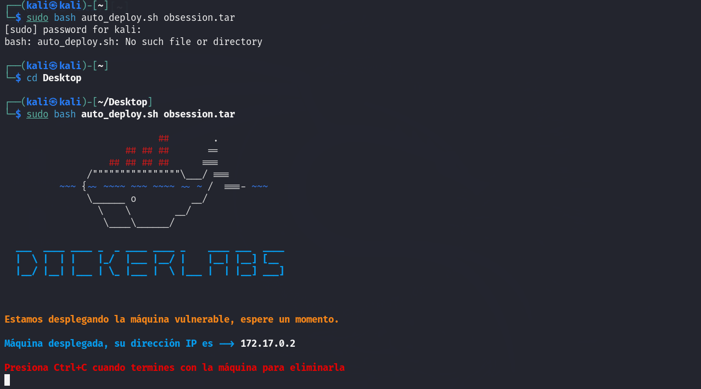

Ya teniendo la IP de la máquina, haremos ping para verificar si hay comunicación y comprobar la conexión:

```
ping <IP máquina>
```

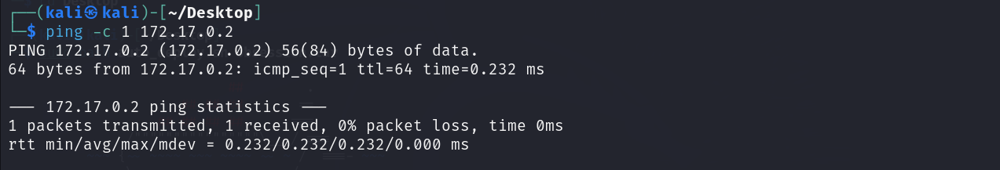

### Escaneo de puertos 

Ahora deberíamos ver qué puertos están abiertos para saber cómo acceder a la máquina. Haremos un escaneo con Nmap utilizando las siguientes opciones:

```
nmap -p- - sS -sCV--min-rate 5000 -vvv -n -Pn <IP máquina> -oN <nombre_archivo.txt>
```

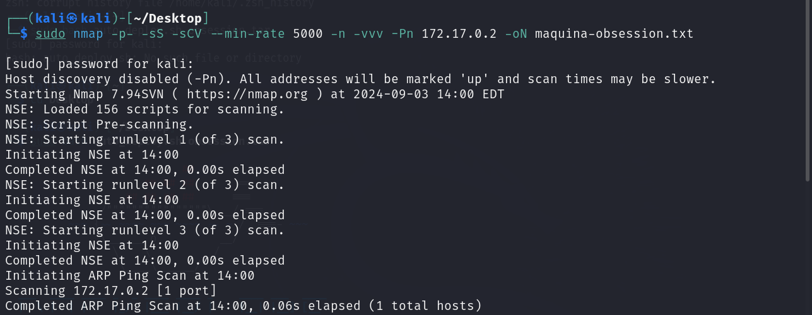

Antes de analizar los resultados, vamos a explicar qué hemos hecho en este comando y por qué no hemos utilizado otras opciones:

- Nmap: La herramienta para el escaneo de puertos.
- -p-: Escanea todos los puertos posibles (1-65535).
- -sS: Realiza un escaneo SYN (half-open) que es más rápido y menos detectable.
- -sCV: Detecta versiones de servicios y ejecuta scripts de Nmap para obtener información adicional.
- --min-rate 5000: Fuerza a Nmap a enviar una tasa mínima de 5000 paquetes por segundo para acelerar el escaneo.
- -vvv: Muestra información detallada en tiempo real sobre el proceso del escaneo.
- -n: No resuelve nombres de dominio, trabajando solo con direcciones IP.
- -Pn: Asume que el host está en línea y omite la fase de descubrimiento (ping scan).
- -oN: Guarda los resultados del escaneo en un archivo de texto.

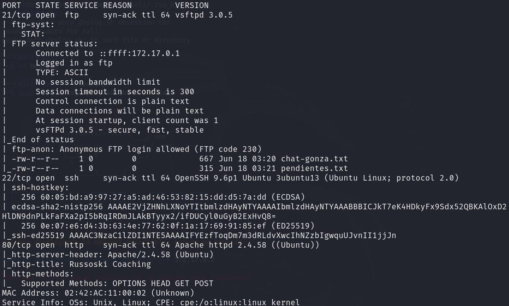

Después del escaneo, observamos que los siguientes puertos están abiertos:

- Puerto 21 (FTP): El servicio FTP está habilitado y permite acceso con el usuario anonymous. En este servicio, encontramos dos archivos de texto que podrían ser de interés.
- Puerto 22 (SSH): Aunque está abierto, no podemos acceder aún porque no tenemos credenciales válidas.
- Puerto 80 (HTTP): Este puerto está abierto y nos permite acceder a una página web a través del navegador.

### PUERTO 80 HTTP

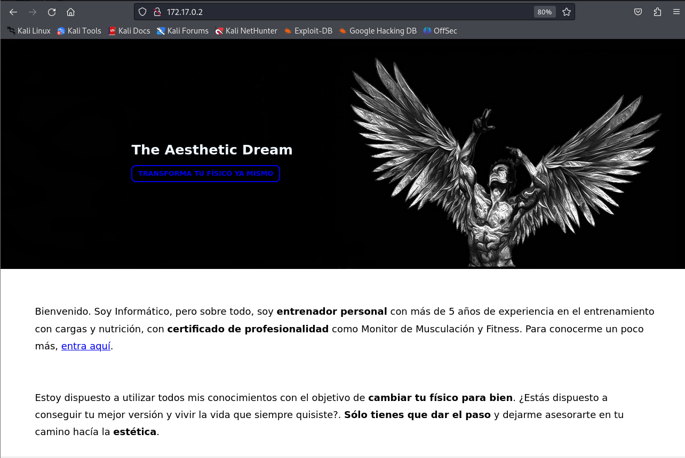

En esta página no encontraremos mucho ya que el unico link que podriamos ver informacion, nos redirigue al autor de la maquina. 

Asi que en este punto no hemos encontrado nada.

### PUERTO 21 FTP

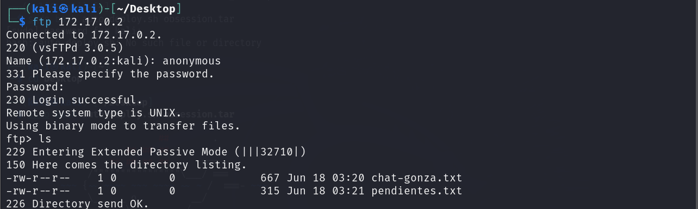

Como ya hemos visto anteriormente a dos archivos que intentaremos descargar mediante el servicio ftp.

Entraremos de esta manera:

```
ftp <ip_maquina>
```

hay que recordar que en el escaneo de puerto no salió un nombre para este servicio, habrá que ponerlo para poder acceder a los archivos después de ya poner el nombre descargaremos dichos archivos con get.

```
get <archivo>
```

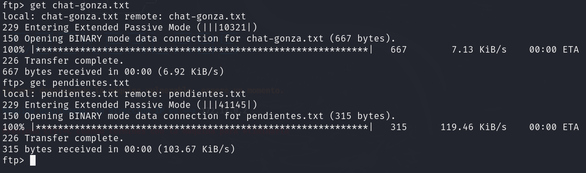

Encontramos una lista de tareas que podría indicar la presencia de permisos mal configurados, y en la otra una conversación que, por el momento, no parece relevante.

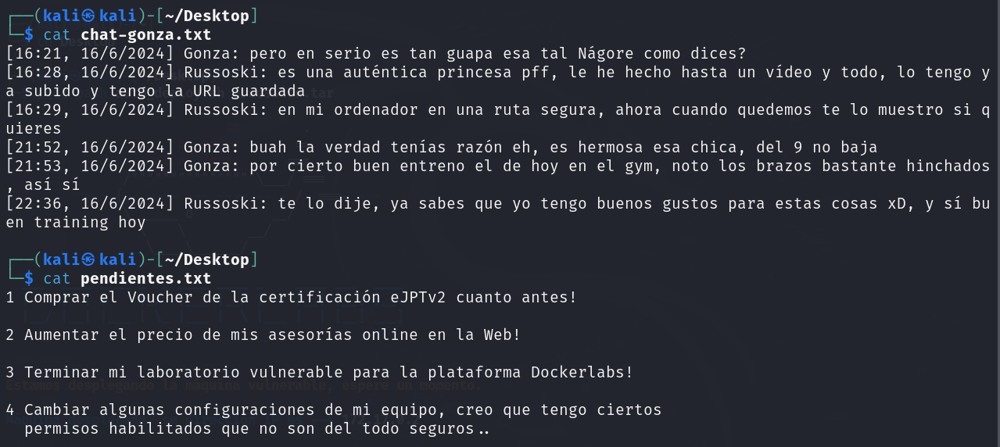

### Gobuster

Ahora sabiendo que no tenemos nada interesante quitando que puede tener mal configurado algunos permisos y ademas de ello tenemos la IP, vamos a usar una herramienta llamada Gobuster que nos ayudará a encontrar directorios ocultos en el servidor web. Además, lo filtraremos por extensiones para encontrar archivos específicos.

```
gobuster dir -u http:/<ip maquina> -w /usr/share/wordlists/dirbuster/directory-list-lowercase-2.3-medium.txt -x html,php,sh,py
```

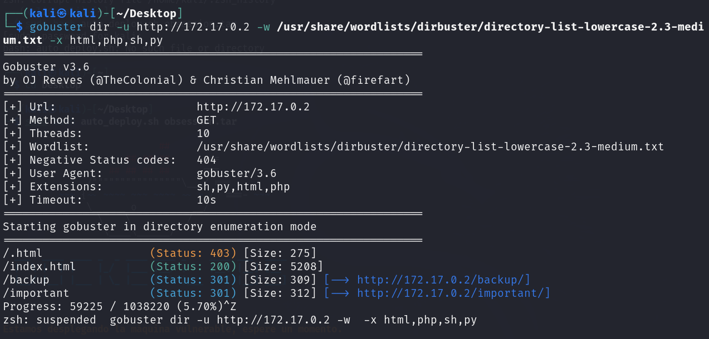

Vamos a ver qué hacen estas opciones:

gobuster dir: Ejecuta Gobuster en modo de búsqueda de directorios.
- -u http://<ip máquina>: Especifica la URL objetivo.
- -w /usr/share/wordlists/dirbuster/directory-list-lowercase-2.3-medium.txt: Define la lista de palabras (wordlist) que Gobuster utilizará para probar nombres de directorios y archivos.
- -x html,php,sh,py: Especifica las extensiones de archivo a buscar (HTML, PHP, SH, PY).

Aquí vemos que nos salen dos directorios:

- /important: Dentro de este directorio encontramos un archivo important.md y es un README. Descargamos el archivo y lo revisamos, pero aqui no parece contener información relevante.

```
<Ip maquina>/important
```

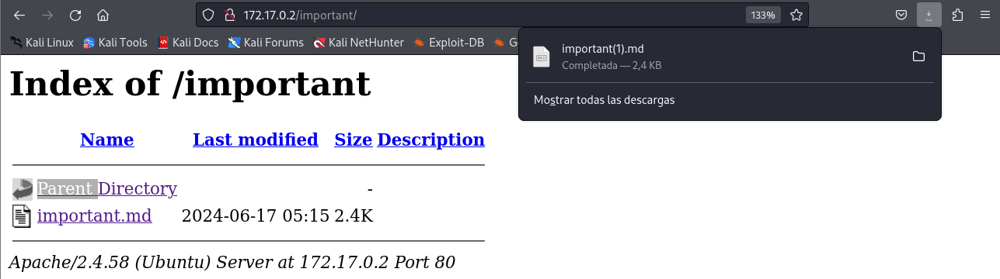

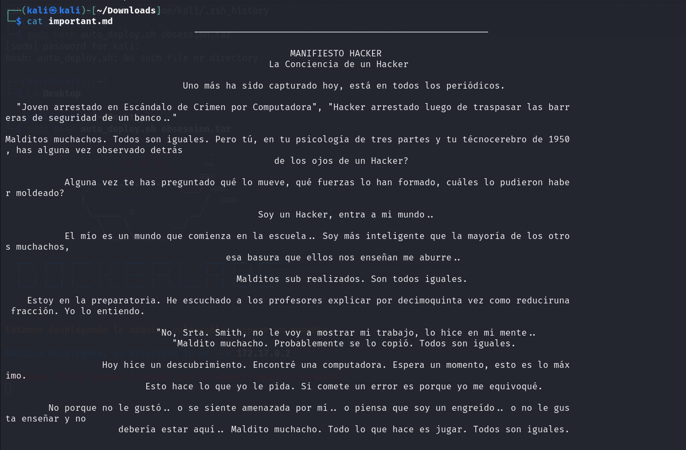

- /backup: En este directorio encontramos un archivo backup.txt. Al acceder a este archivo, obtenemos un mensaje en el navegador indicando la necesidad de cambiar un usuario, mencionando que es el usuario para todos los servicios, lo cual podría ser un dato crucial.

```
<Ip maquina>/backup
```

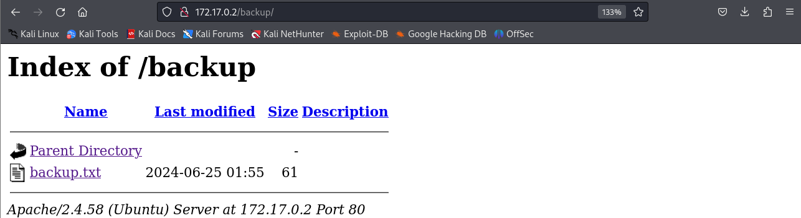

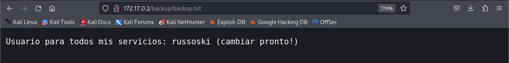

Con esta informacion ya podemos hacer algo interesante.

### Hydra

Ya sabemos que el usuario es russoski y que tenemos el puerto SSH abierto. ¿Cómo continuamos? 

Bueno, usaremos Hydra, ya que nos ayudará a sacar la contraseña mediante un ataque de fuerza bruta.

```
hydra -l russoski -P /usr/share/wordlists/rockyou.txt ssh://<ip maquina> -t 64
```

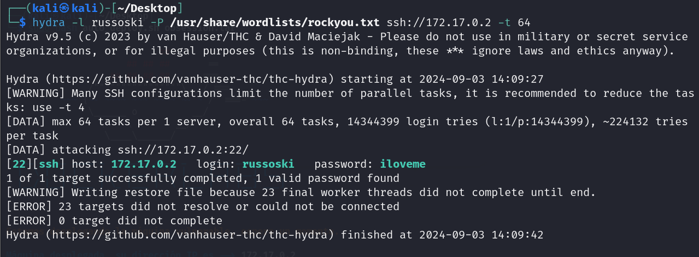

¿Qué estamos haciendo exactamente?

Hydra: Herramienta para ataques de fuerza bruta en servicios de red.
- -l russoski: Especifica el nombre de usuario a utilizar en el ataque.
- -P /usr/share/wordlists/rockyou.txt: Define la lista de contraseñas (wordlist) que Hydra utilizará para probar contra la cuenta de Mario.
- ssh://<ip máquina>: Indica que el objetivo es un servicio SSH en la IP especificada.
- -t 64: Define el número de tareas paralelas que Hydra ejecutará (64 en este caso) para acelerar el proceso.


Aquí veremos que con esta herramienta hemos encontrado la contraseña "iloveme".

Ya que tenemos usuario, contraseña y la IP, el siguiente paso es entrar mediante SSH.

```
ssh russoski@<ip maquina>
```

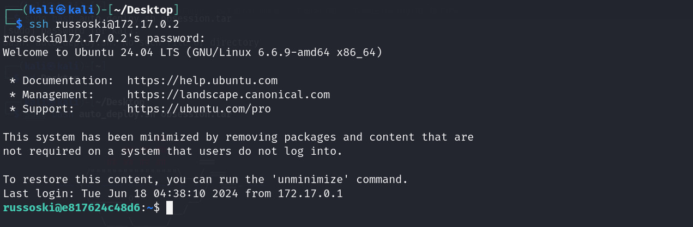


### PUERTO 22 SSH

Después de haber entrado mediante SSH, ya vemos que estamos dentro como russoski. Ahora bien, necesitamos buscar binarios que nos ayuden a escalar privilegios.

Antes de intentar escalar privilegios, buscaremos archivos para obtener más información. No vemos nada que nos ayude, así que seguiremos.

Primero, probaremos si podemos usar `sudo`.

```
sudo -l
```

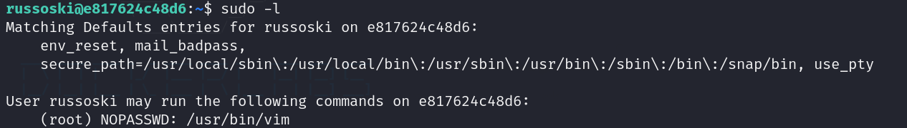

Vemos que Russoski tiene permisos para ejecutar vim.

Vim es un editor de texto en terminal bastante potente, similar a Nano.

¿Qué hacemos con esta información?

Podemos aprovechar los permisos de vim para ejecutar una shell con privilegios de root.

```
sudo -u root /usr/bin/vim -c ':!/bin/sh'
```

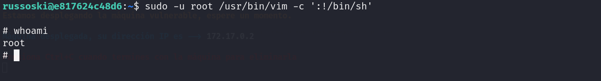

¿Qué hace el comando?

- sudo: Ejecuta un comando como superusuario o como otro usuario.
- -u root /usr/bin/vim: Ejecuta Vim como el usuario root.
- -c ':!/bin/bash': Utiliza la opción -c para ejecutar un comando específico en Vim. En este caso, el comando :!/bin/bash abre una shell (bash) con privilegios de root.

Con todo esto, hemos logrado obtener una shell como usuario root.

#### ¡Gracias por leer y buena suerte con tus futuros ejercicios de hacking ético!
